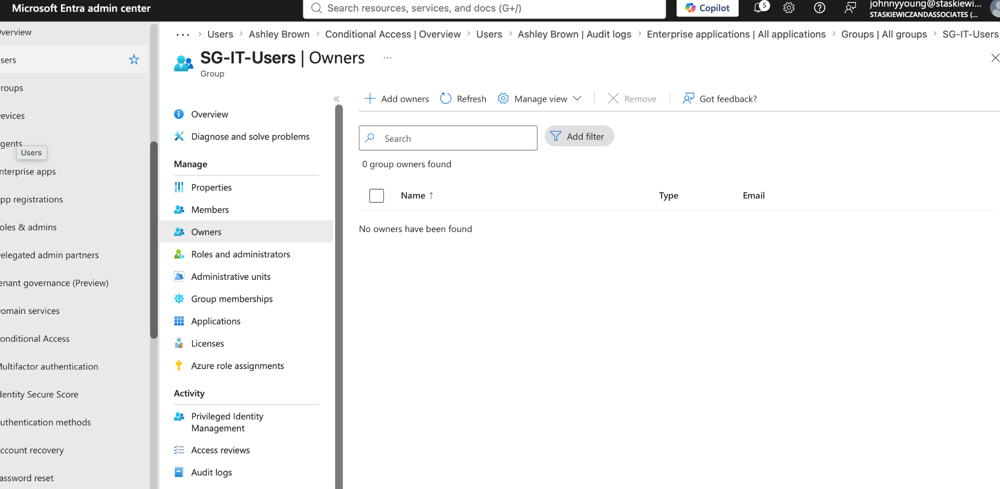
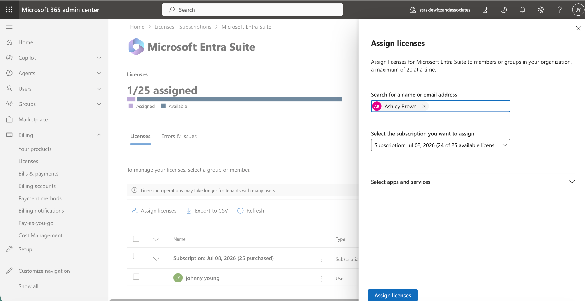
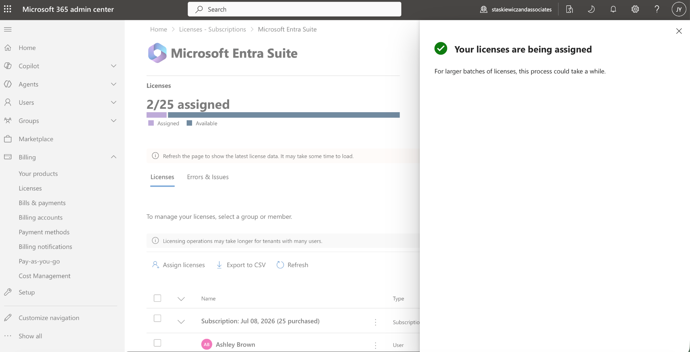
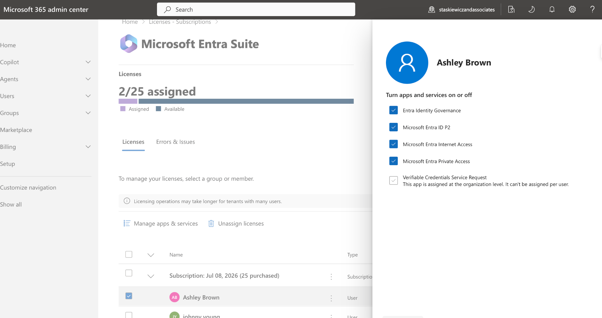
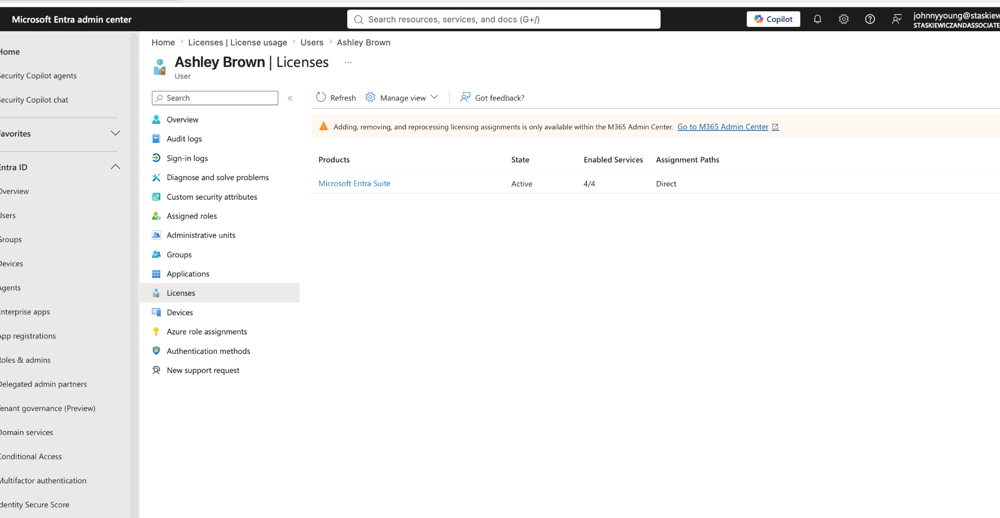
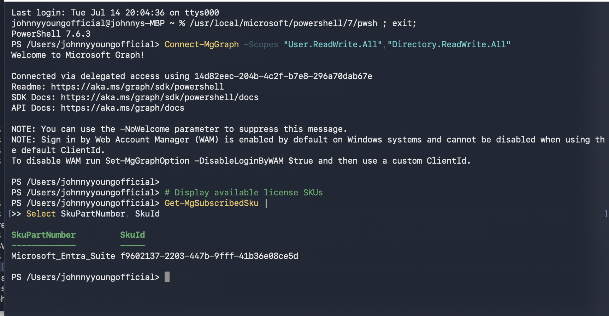

# 🔐 Enterprise Identity & Access Management (IAM) Lab
## Microsoft Entra ID | Identity Governance | Licensing | RBAC | Conditional Access | PowerShell

> A hands-on Microsoft Entra ID enterprise lab simulating identity administration for an organization with approximately **200 employees**.

---

# 📖 Overview

This project demonstrates how an Identity & Access Management (IAM) Analyst manages users throughout their lifecycle while securing access to organizational resources.

The lab focuses on common enterprise administration tasks performed daily by IAM professionals including:

- User provisioning
- Identity Governance
- License administration
- Security groups
- Manager relationships
- Role-Based Access Control (RBAC)
- Conditional Access
- Multi-Factor Authentication (MFA)
- Microsoft Graph PowerShell automation

---

# 🏢 Business Scenario

A fictional company, **Staskiewicz & Associates**, has grown to over 200 employees.

As the IAM Administrator, my responsibilities included:

- Creating and managing users
- Assigning departments and managers
- Managing security groups
- Assigning Microsoft Entra Suite licenses
- Enabling Identity Governance
- Enforcing Conditional Access & MFA
- Verifying assignments with Microsoft Graph PowerShell

---

# 🎯 Project Objectives

✔ Build an enterprise-ready Entra ID environment

✔ Simulate identity lifecycle management

✔ Configure licensing

✔ Secure users using Conditional Access

✔ Validate administration using PowerShell

---

# 🛠 Technologies

- Microsoft Entra ID
- Microsoft 365 Admin Center
- Microsoft Graph PowerShell
- Azure CLI
- macOS PowerShell 7

---

# 🔐 Identity Governance

Configured users with:

- Manager relationships
- Security Groups
- Group Owners
- Microsoft Entra Suite licensing
- Identity Governance (P2)

---

# 💻 PowerShell Used

## Connect to Microsoft Graph

```powershell
Connect-MgGraph -Scopes "User.ReadWrite.All","Directory.ReadWrite.All"
```

## Display available licenses

```powershell
Get-MgSubscribedSku |
Select SkuPartNumber,SkuId
```

## Verify a user

```powershell
$UserUPN="ashley.brown@staskiewiczandassociates.onmicrosoft.com"

az ad user show --id $UserUPN --output table
```

---

# 📸 Project Screenshots

## Group Ownership


## Assign Microsoft Entra Suite License


## License Assignment Completed


## Enabled License Services


## User License Verification


## PowerShell - Display Available SKUs


## PowerShell - Verify User


## PowerShell - License Details


---

# 📈 Skills Demonstrated

- Identity & Access Management
- Microsoft Entra ID Administration
- Identity Governance
- Microsoft Entra Suite Licensing
- User Lifecycle Management
- Security Group Administration
- RBAC
- Conditional Access
- Multi-Factor Authentication
- Microsoft Graph PowerShell
- Azure CLI

---

# 🚀 Outcome

Successfully implemented an enterprise-ready Microsoft Entra ID environment demonstrating practical IAM skills used by Identity & Access Management Analysts.

This project showcases hands-on experience with identity administration, licensing, governance, security, and automation suitable for an IAM Analyst portfolio.
